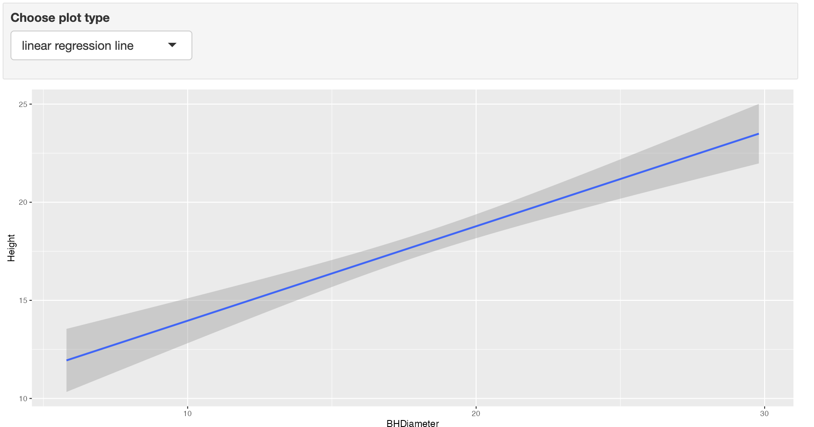
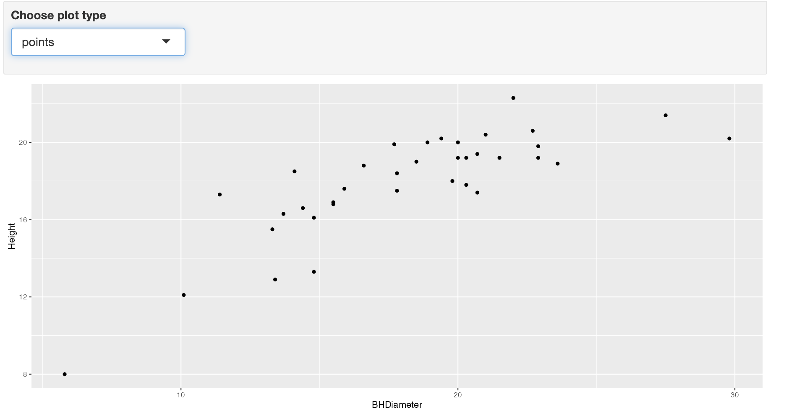
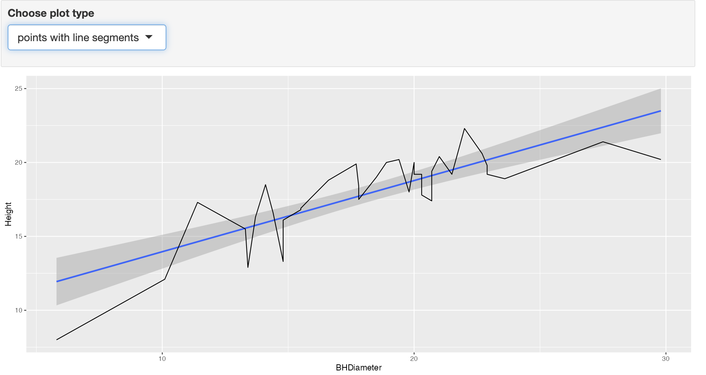

```{r setup, include=FALSE}
knitr::opts_chunk$set(echo = TRUE)
```

# Tasks

These are the tasks for lab 3

## Task 1

Get working directory

```{r}
getwd()
```

## Task 2

## Read in spruce and print the head of the data.
```{r}
spruce.df = read.csv("SPRUCE.csv")
head(spruce.df)
```

## Task 3


## Create a scatter plot to view relationship between Tree Height and BHDiameter
```{r}
plot(spruce.df$BHDiameter, spruce.df$Height,
     main = "Spruce Tree Height vs Breast Height Diameter",
     xlab = "Breast Height Diameter (cm)",
     ylab = "Tree Height (m)",
     pch = 21,                
     bg = "blue",             
     cex = 1.2,                
     xlim = c(0, 1.1 * max(spruce.df$BHDiameter)),
     ylim = c(0, 1.1 * max(spruce.df$Height)))

```

## Does there appear to be a straight line relationship?
There seems to be a slight straight line relationship based on the graph but overall the dots are fairly spread apart. This means that the relationship is as not as strong as we want it to be for a straight line relationship.

## Loading s20x and plotting with f= .5 .6 .7

```{r}
library(s20x)

layout(matrix(1:3, nrow = 1, ncol = 3))


trendscatter(spruce.df$BHDiameter, spruce.df$Height, f = 0.5,
             main = "LOWESS (f = 0.5)",
             xlab = "Breast Height Diameter (cm)",
             ylab = "Tree Height (m)")

trendscatter(spruce.df$BHDiameter, spruce.df$Height, f = 0.6,
             main = "LOWESS (f = 0.6)",
             xlab = "Breast Height Diameter (cm)",
             ylab = "Tree Height (m)")

trendscatter(spruce.df$BHDiameter, spruce.df$Height, f = 0.7,
             main = "LOWESS (f = 0.7)",
             xlab = "Breast Height Diameter (cm)",
             ylab = "Tree Height (m)")
```


## Make a linear model object called spruce.lm
```{r}
spruce.lm <- lm(Height ~ BHDiameter, data = spruce.df)
summary(spruce.lm)
```


## Make a new scatterplot and add least squares regression line

```{r}
spruce.lm <- lm(Height ~ BHDiameter, data = spruce.df)
summary(spruce.lm)

## Scatter plot with regression line
plot(spruce.df$BHDiameter, spruce.df$Height,
     xlab = "Breast Height Diameter (cm)",
     ylab = "Tree Height (m)",
     pch = 21,                
     bg = "blue",             
     cex = 1.2,                
     xlim = c(0, 1.1 * max(spruce.df$BHDiameter)),
     ylim = c(0, 1.1 * max(spruce.df$Height)))

abline(spruce.lm)
```

## Comment on graph

The relationship between the dots and the line is not as strong as we need it to be. The smoother curves for each f value show curvature to follow the trend of the dots.

## Task 4

## Changing layout using layout.show(4)
```{r}
lo = layout(matrix(1:4, nr = 2, nc = 2, byrow = TRUE))

layout.show(4)
```


## Four scatter plots in 4 equal areas
```{r}
# Define layout: 2 rows x 2 cols
layout(matrix(1:4, nrow = 2, ncol = 2, byrow = TRUE))

mycex = 1.0

# 1. Scatter plot and fitted line
with(spruce.df,
     plot(Height ~ BHDiameter, main = "Tree Height vs BHDiameter",
          xlab = "Breast Height Diameter (cm)", ylab = "Height of Tree (m)",
          ylim = c(0, 1.1 * max(Height)), xlim = c(0, 1.1 * max(BHDiameter)))
)
abline(spruce.lm)

# 2. Residuals (RSS)
yhat = fitted(spruce.lm)
with(spruce.df, 
     plot(Height ~ BHDiameter, main = "RSS", 
          xlab = "Breast Height Diameter (cm)", ylab = "Height of Tree (m)",
          bg = "blue", pch=21, cex = mycex,
          ylim = c(0, 1.1 * max(Height)), xlim = c(0, 1.1 * max(BHDiameter)))
)
with(spruce.df, segments(BHDiameter, Height, BHDiameter, yhat))
abline(spruce.lm)

# 3. Model + mean (MSS)
with(spruce.df,
     plot(Height ~ BHDiameter, main = "MSS",
          xlab = "Breast Height Diameter (cm)", ylab = "Height of Tree (m)",
          bg = "blue", pch=21, cex = mycex,
          ylim = c(0, 1.1 * max(Height)), xlim = c(0, 1.1 * max(BHDiameter)))
)
abline(h = mean(spruce.df$Height))
with(spruce.df, segments(BHDiameter, mean(Height), BHDiameter, yhat, col = "red"))
abline(spruce.lm)

# 4. Mean + total deviation (TSS)
with(spruce.df,
     plot(Height ~ BHDiameter, main = "TSS - Plot by possible Student",
          xlab = "Breast Height Diameter (cm)", ylab = "Height of Tree (m)",
          bg = "blue", pch=21, cex = mycex,
          ylim = c(0, 1.1 * max(Height)), xlim = c(0, 1.1 * max(BHDiameter)))
)
abline(h = mean(spruce.df$Height))
with(spruce.df, segments(BHDiameter, Height, BHDiameter, mean(Height), col = "green"))

```

## Calculate TSS, MSS, RSS

## RSS
```{r}
RSS = with(spruce.df, sum((Height - yhat) ^ 2 ))
RSS
```

## MSS
```{r}
MSS = with(spruce.df, sum((yhat - mean(Height)) ^ 2 ))
MSS
```

## TSS
```{r}
TSS = with(spruce.df, sum((Height - mean(Height)) ^ 2 ))
TSS
```

## Calculate MSS / TSS And interpret

```{r}
MSS / TSS
```

MSS / TSS is the multiple r squared. Its value 0.6570 is not that high meaning a straight line is not the best fit for this data

## Does TSS = MSS + RSS

```{r}
RSS + MSS
```

TSS does = MSS + RSS


## Task 5

## Summary for spruce.lm
```{r}
summary(spruce.lm)
```

## Values of slope and intercept
```{r}
coef(spruce.lm)
```
Slope = .4814743

Intercept = 9.1468390


## The equation of the fitted line is:

$$
\text{Height} = B_0 + B_1 \cdot x
$$

With actual coefficients:

$$
\text{Height} = 9.1468 + 0.4815 \cdot x \\
R^2 = \frac{\text{MSS}}{\text{TSS}}
$$


## Predictions
```{r}
predict(spruce.lm, data.frame(BHDiameter = c(15, 18, 20)))
```


## Task 6

## GGplot 

```{r}
library(ggplot2)

g = ggplot(spruce.df, aes(x = BHDiameter, y = Height, color = BHDiameter))

g = g + geom_point() + geom_line() + geom_smooth(method = "lm")

g = g + ggtitle("Tree Height vs Breast Height Diameter - Plot by Robert C")

g
```


## Task 7

{width=70%}
{width=70%}
{width=70%}


